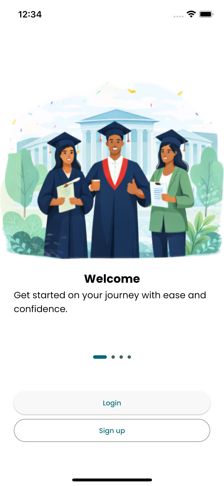
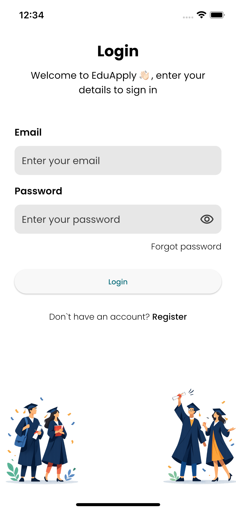
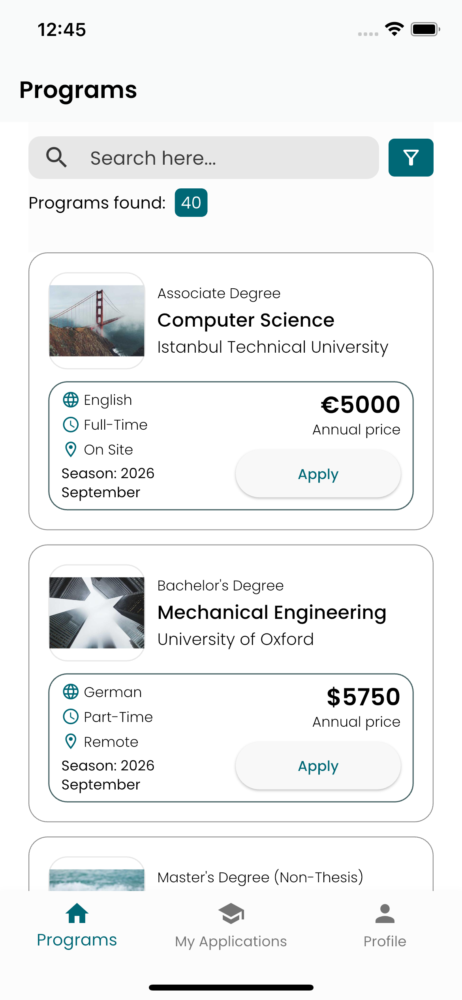
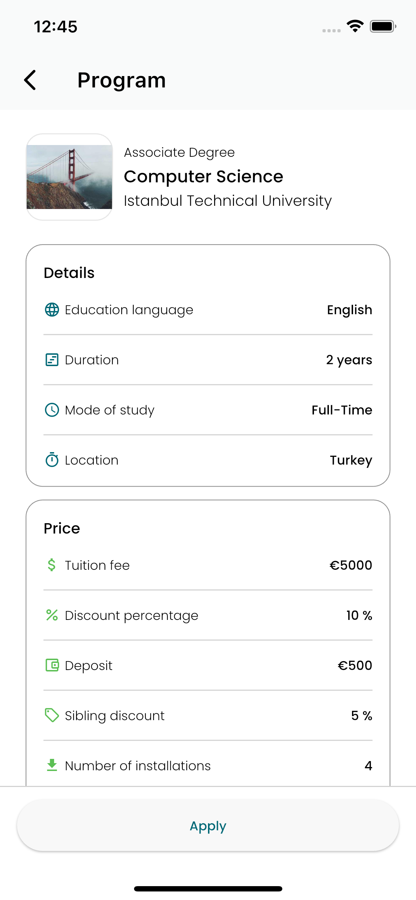
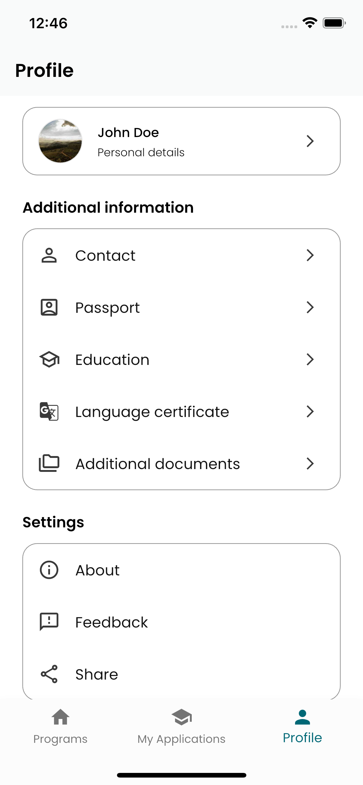
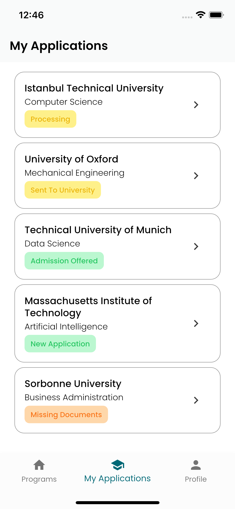

<p align="center">
  
</p>

<h1 align="center">EduApply</h1>

<p align="center">
  <b>A modern mobile application for searching and applying to university programs worldwide</b>
</p>

<p align="center">
  
  
  
  
</p>

---

## 📖 About

**EduApply** streamlines the university application journey — from discovering programs and exploring universities to submitting applications and tracking their progress. Built with Flutter and following Clean Architecture principles, the app delivers a polished, production-ready experience.

---

## ✨ Features

| Category | Highlights |
|---|---|
| 🔐 **Authentication** | Sign In, Sign Up, Forgot Password, Onboarding flow, Token-based auto-login |
| 🎓 **Program Search** | Browse university programs, filter by country, view detailed program info |
| 📝 **Applications** | Apply to programs, track application status, view logs & comments |
| 👤 **Profile Management** | Personal details, contact info, passport, education history, language certificates, document uploads |
| 📁 **Document Management** | Upload & manage supporting documents, profile photo |
| 🌍 **Localization** | English & Spanish language support |

---

## 📸 Screenshots


<p align="center">
  
  &nbsp;&nbsp;
  
  &nbsp;&nbsp;
  
</p>
<p align="center">
  <em>Onboarding &nbsp;&nbsp;&nbsp;&nbsp;&nbsp;&nbsp;&nbsp;&nbsp;&nbsp;&nbsp;&nbsp;&nbsp;&nbsp;&nbsp;&nbsp; Sign In &nbsp;&nbsp;&nbsp;&nbsp;&nbsp;&nbsp;&nbsp;&nbsp;&nbsp;&nbsp;&nbsp;&nbsp;&nbsp;&nbsp;&nbsp; Program Search</em>
</p>

<p align="center">
  
  &nbsp;&nbsp;
  
  &nbsp;&nbsp;
  
</p>
<p align="center">
  <em>Program Details &nbsp;&nbsp;&nbsp;&nbsp;&nbsp;&nbsp;&nbsp;&nbsp;&nbsp;&nbsp;&nbsp; Profile &nbsp;&nbsp;&nbsp;&nbsp;&nbsp;&nbsp;&nbsp;&nbsp;&nbsp;&nbsp;&nbsp;&nbsp;&nbsp;&nbsp;&nbsp;&nbsp;&nbsp; Applications</em>
</p>

---

## 🏗️ Architecture

The project follows **Clean Architecture** with a feature-first folder structure, ensuring separation of concerns, testability, and scalability.

```
lib/
├── core/                    # Shared utilities, theme, routing, localization
│   ├── common/              # Common widgets & extensions
│   ├── const/               # Generated asset constants
│   ├── l10n/                # Localization (EN, ES)
│   ├── router/              # GoRouter navigation setup
│   ├── theme/               # AppBar, buttons, text & input themes
│   └── utils/               # Helper utilities
│
├── features/
│   ├── auth/                # Authentication (sign in, sign up, onboarding)
│   ├── program/             # University program search & details
│   ├── profile/             # User profile management
│   ├── application/         # Application submission & tracking
│   └── navigation_screen/   # Bottom navigation shell
│
├── app.dart                 # Root MaterialApp configuration
├── init_dependencies.dart   # Dependency injection setup
└── main.dart                # App entry point
```

Each feature module is organized into three layers:

```
feature/
├── data/           # Data sources, models, repository implementations
├── domain/         # Entities, repository interfaces, use cases
└── presentation/   # BLoC/Cubit, screens, widgets
```

---

## 🛠️ Tech Stack

| Layer | Technology |
|---|---|
| **Framework** | Flutter 3.2+ |
| **State Management** | flutter_bloc (BLoC & Cubit) |
| **Navigation** | GoRouter |
| **Dependency Injection** | GetIt |
| **Theming** | FlexColorScheme (Cyan M3) |
| **Functional Programming** | fpdart (Either, Option) |
| **Localization** | Flutter intl / ARB files |
| **Typography** | Poppins (custom font family) |
| **Animations** | Lottie |
| **Image Handling** | cached_network_image, image_picker |
| **File Management** | file_picker, path_provider |

---

## 🚀 Getting Started

### Prerequisites

- Flutter SDK `>=3.2.3`
- Dart SDK `>=3.2.3`
- Android Studio / Xcode (for emulators)

### Installation

```bash
# Clone the repository
git clone https://github.com/your-username/edu-apply.git
cd edu-apply

# Install dependencies
flutter pub get

# Set up environment variables
cp .env.default .env

# Run the app
flutter run
```

### Environment Configuration

The app uses `flutter_dotenv` for environment configuration. Copy `.env.default` to `.env` and fill in the required values before running.

---

## 📂 Key Screens

| Screen | Description |
|---|---|
| **Onboarding** | Welcome walkthrough for new users |
| **Sign In / Sign Up** | Authentication with email & password |
| **Program Search** | Browse & filter university programs by country |
| **Program Details** | Detailed view of program info, requirements & fees |
| **Application Overview** | Review profile & submit application to a program |
| **Application List** | Track all submitted applications |
| **Application Details** | View status, logs, files & comments per application |
| **Profile** | Manage personal info, education, passport, certificates |
| **Document Upload** | Attach supporting documents to your profile |

---

## 🤝 Contributing

Contributions, issues and feature requests are welcome! Feel free to open a pull request or submit an issue.

---

## 📄 License

This project is for portfolio/showcase purposes.

---

## ⭐ Show Your Support

If you found this project useful or interesting, please consider giving it a **star** ⭐ — it helps a lot and motivates further development!

---

<p align="center">
  Built with ❤️ using Flutter
</p>
